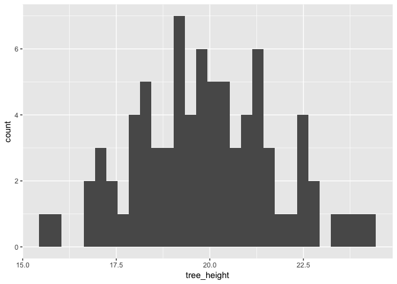
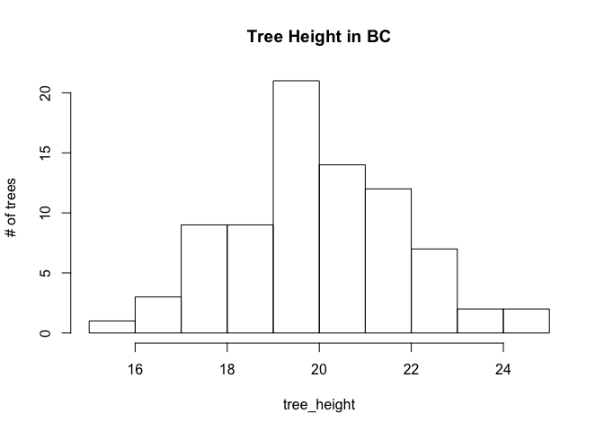
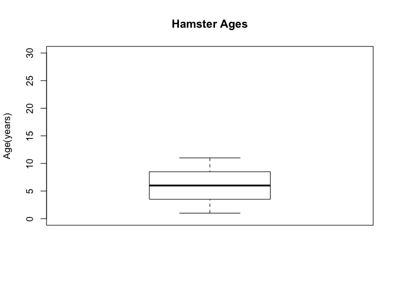
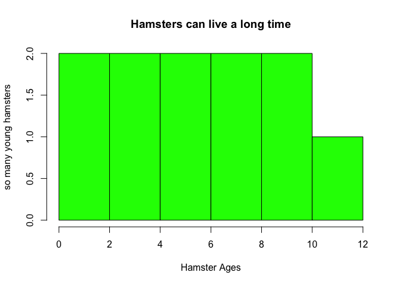
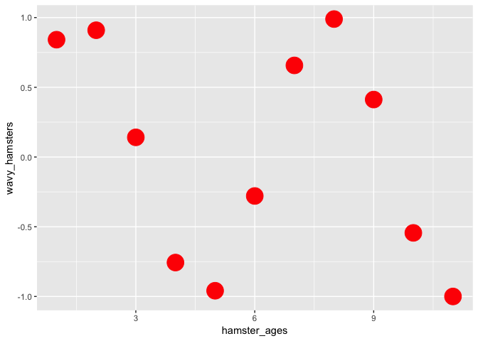

DTA\_L3\_RMD Practice
================

### Tree Heights in British Columbia

``` r
library(tidyverse)
```

    ## ── Attaching packages ─────────── tidyverse 1.2.1 ──

    ## ✔ ggplot2 3.0.0     ✔ purrr   0.2.5
    ## ✔ tibble  1.4.2     ✔ dplyr   0.7.6
    ## ✔ tidyr   0.8.1     ✔ stringr 1.3.1
    ## ✔ readr   1.1.1     ✔ forcats 0.3.0

    ## ── Conflicts ────────────── tidyverse_conflicts() ──
    ## ✖ dplyr::filter() masks stats::filter()
    ## ✖ dplyr::lag()    masks stats::lag()

``` r
#Generate normal distribution of 80 points, mean of 20, SD = 2
tree_height = rnorm(80, 20, 2)

#Find log of tree heights
log_tree_height = log(tree_height)

#Organize datasets in neat tibble frame, define as la_df
la_df = tibble(tree_height, log_tree_height)

#create histogram with ggplot package, referencing tidy dataset la_df
ggplot(la_df, aes(x = tree_height)) + geom_histogram()
```

    ## `stat_bin()` using `bins = 30`. Pick better value with `binwidth`.



``` r
#create another histogram
hist(tree_height, main = "Tree Height in BC", ylab = "# of trees")
```



### Age of Household Hamsters

``` r
hamster_ages = c(1, 2, 3, 4, 5, 6, 7, 8, 9, 10, 11)
mean (hamster_ages)
```

    ## [1] 6

``` r
boxplot(hamster_ages, main = "Hamster Ages", ylab = "Age(years)", ylim = c(0,30))
```



``` r
hist(hamster_ages, main = "Hamsters can live a long time", ylab = "so many young hamsters", xlab = "Hamster Ages", col = "green")
```



``` r
wavy_hamsters = sin(hamster_ages)

la_df = tibble (hamster_ages, wavy_hamsters)

ggplot(la_df, aes(x = hamster_ages, y = wavy_hamsters)) + geom_point(col = "red", size = 8, main = "ham")
```

    ## Warning: Ignoring unknown parameters: main



Including Plots
---------------

You can also embed plots, for example:


Note that the `echo = FALSE` parameter was added to the code chunk to prevent printing of the R code that generated the plot.
