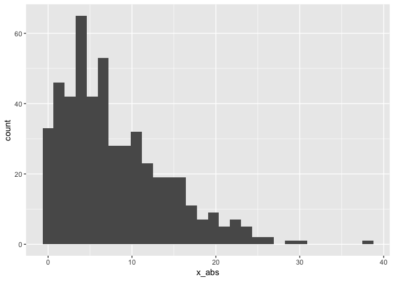
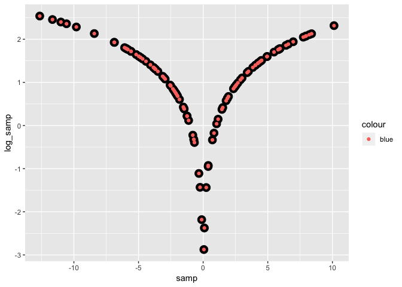

DTA\_L4\_GIT
================
Joy Hsu
2018-09-11

This R markdown will be used to learn GIT. Markdown copied from L3. Writing with Data.

-   Generally, render RMD to HTML document
-   name r chunks with something useful

Section 0 - YAML and output formats
===================================

-   The YAML header controls the global features of the document. Always include author and date
-   you can modify the output format with subfields

``` r
#add table of contents to the output
output:
  html_document:
    toc: true
    toc_float: true
#hide all the code in the document until the reader clicks to show it
output:
  html_document:
    code_folding: hide
#different types of outputs:
output:
  pdf_document: default
  word_document: defaults
  github_document
```

Section 1 - Formatting
======================

-   Here's a **code chunk** that samples from a *normal distribution*:

``` r
#sample from normal distribution
samp = rnorm(100)

#length of sample
length(samp)
## [1] 100
```

Section 2 - Inline Code & Text
==============================

Execute Inline code: `r` Write inline code: \` \`

I can take the mean of the sample, too! The mean is -0.1076199. Nonexecuted code `mean(samp)`.

Section 3 - Customize Chunk
===========================

-   `eval = FALSE`: code will be displayed but not executed; results are not included.
-   `echo = FALSE`: code will be executed but not displayed; results are included.
-   `include = FALSE`: code will be executed but not displayed; results are not included.
-   `message = FALSE` and warning = FALSE: prevents messages and warnings from being displayed.
-   `results = hide` and fig.show = hide: prevents results and figures from being shown, respectively.
-   `collapse = TRUE`: output will be collapsed into a single block at shown at the end of the chunk.
-   `error`: errors in code will stop rendering when FALSE; errors in code will be printed in the doc when TRUE. The default is FALSE and you should almost never change it.

Section 4 - Learning Assessments
================================

1.  The chunk below creates a dataframe containing a sample of size 500 from a normally distributed RV and the absolute value of each element in the sample. A histogram is generated for the absolute values. Note, code can be hidden with `echo=FALSE`.

``` r
#create a variable containing random sample size 500
set.seed(1)
x = rnorm(500, 0, 10)

#compute absolute value of each element
x_abs = abs(x)

#produce histogram. 
x_df = tibble(x, x_abs)
ggplot(x_df, aes(x = x_abs), colour = "blue") + geom_histogram()
```



``` r

#Add an inline summary giving the median value rounded to two decimal places.
```

The median of the variable containing absolute values is 6.4082932

Median round to two digits is 6.41

1.  Learning Assessment 2. The chunk below creates a tibble data frame and generates variables directly in the df. Two `geom_point` layer spots.

``` r
#tibble - bind vectors into data frame
log_df = tibble(
  samp = rnorm(100, 0, 5),
  log_samp = log(abs(samp))
)

#create plot using variables 
ggplot(log_df, aes(x = samp, y = log_samp)) + 
  geom_point(colour = "black", size = 4.5) +
  geom_point(aes(colour = "blue"))
```



1.  Learning Assessment 3. The chunk below creates a bullet list given the mean, median, and standard deviation of the original random sample.

-   The mean of RV is -0.1076199
-   The median of RV is -0.162187
-   The standard deviation of RV is 1.0047339

Section 5 - Text Formatting
===========================

*italic* or *italic* **bold** or **bold** `code` superscript<sup>2</sup> and subscript<sub>2</sub>

Headings
--------

1st Level Header
================

2nd Level Header
----------------

### 3rd Level Header

Lists
-----

-   Bulleted list item 1

-   Item 2

    -   Item 2a

    -   Item 2b

1.  Numbered list item 1

2.  Item 2. The numbers are incremented automatically in the output.

3.  Test

Tables
------

| First Header | Second Header |
|--------------|---------------|
| Content Cell | Content Cell  |
| Content Cell | Content Cell  |
